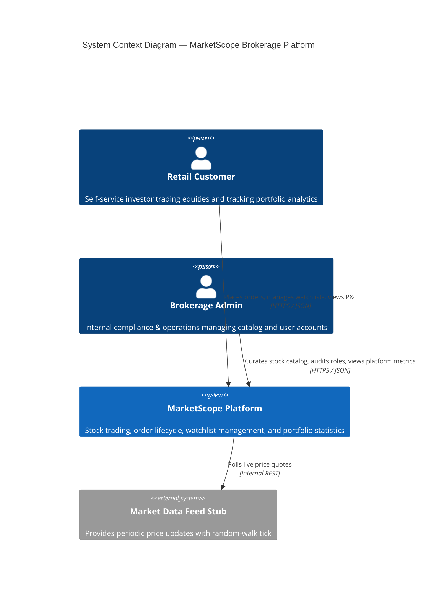
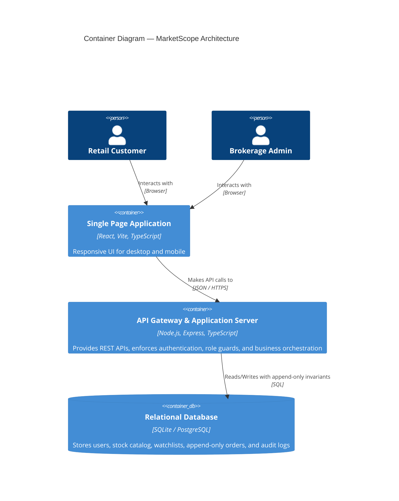
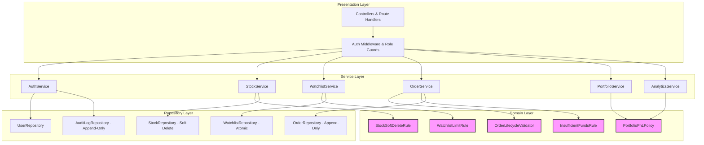
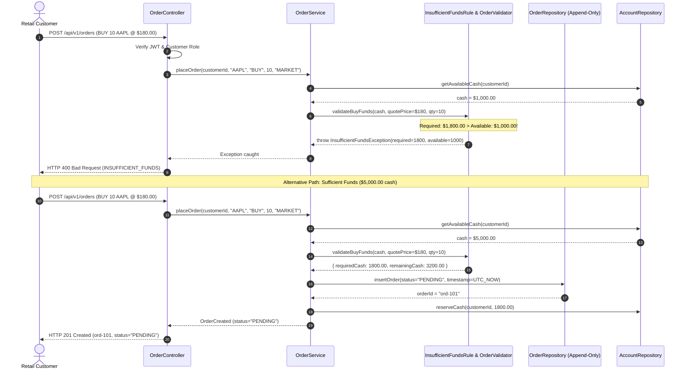

# MarketScope System Architecture
## Technical Architecture & Layered Design (docs/architecture.md)

---

## 1. Architectural Overview & C4 Model

MarketScope implements a clean, 4-tier enterprise architecture engineered for strict role separation, append-only regulatory ledgers, and deterministic fixed-point financial calculations.

### 1.1 C4 Context Diagram

### 1.2 C4 Container Diagram

---

## 2. 4-Tier Layered Architecture

### Layer Constraints:
1. **Controllers**: Input validation, JWT extraction, role checks (`requireRole('ADMIN')` vs `requireRole('CUSTOMER')`). Must NEVER import repositories.
2. **Services**: Transaction boundaries and business orchestration.
3. **Domain Layer**: Pure business logic, zero framework dependencies, fixed-point math (`Decimal.js`).
4. **Repositories**: Data access with strict append-only constraints on executed trades and audit logs.

---

## 3. Order Placement Sequence Diagram (AC-06, AC-07, AC-08)

